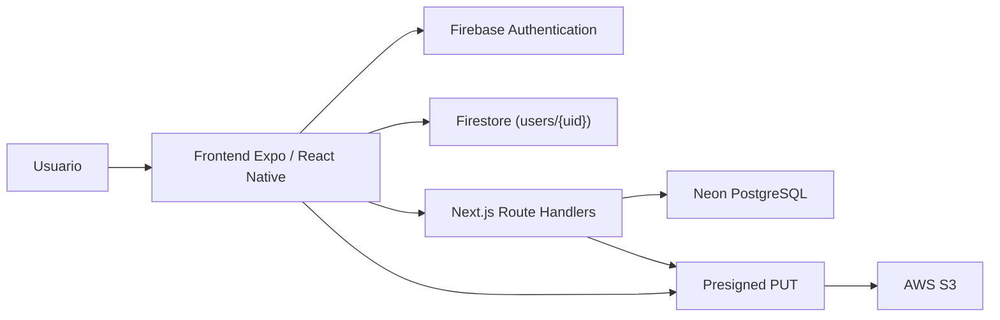

# NoteFlow Dev

## Descripción

NoteFlow Dev es una aplicación de productividad centrada en la organización de información personal. Permite gestionar notas, ideas y checklists desde una interfaz móvil/web construida con Expo y React Native, apoyada por un backend independiente en Next.js, una base de datos PostgreSQL en Neon, autenticación con Firebase y almacenamiento de avatares en AWS S3.

La aplicación está pensada como proyecto académico full stack y combina funcionalidades de organización personal con integración de servicios cloud y capacidades nativas del dispositivo.

## Objetivos

El objetivo principal del proyecto es resolver un problema habitual en estudiantes y perfiles técnicos: concentrar en una única herramienta la captura de apuntes, ideas, tareas, recordatorios y contexto personal sin depender de varias aplicaciones distintas.

Objetivos funcionales:

- centralizar notas, ideas y checklists;
- asociar cada dato a un usuario autenticado;
- mantener backend y frontend separados;
- persistir la información en una base de datos real;
- integrar autenticación, avatar, recordatorios y ubicación.

## Tecnologías utilizadas

### Frontend

- React Native
- Expo
- TypeScript
- Expo Router

Tecnologías adicionales presentes en el código:

- Zustand
- AsyncStorage
- Expo Image Picker
- Expo Notifications
- Expo Location
- Expo Linear Gradient
- React Native Gesture Handler
- React Native Reanimated

### Backend

- Next.js
- TypeScript

Tecnologías adicionales presentes en el backend:

- Zod
- AWS SDK v3
- `@neondatabase/serverless`

### Base de datos

- PostgreSQL (Neon)

### Autenticación

- Firebase Authentication
- Firestore

### Almacenamiento de archivos

- AWS S3

## Arquitectura del proyecto

El sistema está dividido en dos aplicaciones coordinadas:

### Frontend

Aplicación Expo/React Native responsable de:

- navegación con Expo Router;
- renderizado de la interfaz;
- autenticación del usuario;
- interacción con permisos nativos;
- comunicación con la API;
- renderizado del avatar.

### Backend

Aplicación Next.js que:

- expone endpoints REST mediante Route Handlers;
- valida datos con Zod;
- consulta y modifica PostgreSQL en Neon;
- genera Presigned URLs para AWS S3.

### Firebase

Se usa para:

- identidad del usuario con Firebase Authentication;
- perfil extendido en Firestore (`users/{uid}`).

### Neon PostgreSQL

Se usa para persistir:

- notas;
- ideas;
- checklists;
- fechas;
- ownership por usuario;
- campos de geolocalización.

### AWS S3

Se usa para almacenar los archivos de avatar y guardar únicamente la URL resultante en Firestore.

### Diagrama general



## Funcionalidades implementadas

- Firebase Authentication
- Perfil de usuario
- Persistencia de sesión
- CRUD de notas
- CRUD de ideas
- CRUD de checklists
- PostgreSQL (Neon)
- AWS S3 para avatares
- Notificaciones locales
- Geolocalización
- Animaciones de entrada
- Swipe-to-delete

### Gestión de notas

- Crear notas
- Editar notas
- Eliminar notas
- Guardar fechas de inicio y fin
- Guardar ubicación opcional
- Filtrar por usuario autenticado

### Checklists

- Crear notas de tipo checklist
- Añadir elementos
- Marcar elementos como completados
- Eliminar checklist

### Ideas

- Crear ideas
- Guardar descripción y etiquetas
- Consultar ideas del usuario
- Eliminar ideas

### Autenticación

- Registro
- Inicio de sesión
- Persistencia de sesión
- Perfil de usuario

El perfil en Firestore incluye:

- `uid`
- `name`
- `email`
- `createdAt`
- `avatarUrl`

### Avatares

- Selección de imagen desde galería
- Petición de Presigned URL al backend
- Subida directa del archivo a AWS S3
- Guardado de `avatarUrl` en Firestore
- Renderizado del avatar en la app

### Notificaciones locales

- Programación de recordatorios
- Gestión de permisos
- Apertura de Ajustes si el permiso está denegado

### Geolocalización

- Obtención de ubicación actual
- Guardado de `latitude`
- Guardado de `longitude`
- Guardado de `location_name`

### Animaciones

- Animaciones de entrada y feedback usando `Animated`
- Transiciones visuales en dashboard y checklist

### Gestos

- **Swipe-to-delete** implementado en la lista de apuntes recientes del dashboard de notas mediante `SwipeableCard`

## Permisos nativos

### Notificaciones

La app solicita permisos de notificaciones después de la autenticación del usuario.

Comportamiento implementado:

- comprobación del estado actual del permiso;
- solicitud del permiso si no está concedido;
- creación de canal Android para recordatorios;
- posibilidad de abrir Ajustes si el permiso fue denegado.

Archivos relevantes:

- [/Users/adri/Developer/noteflow/app/_layout.tsx](/Users/adri/Developer/noteflow/app/_layout.tsx)
- [/Users/adri/Developer/noteflow/lib/notifications.ts](/Users/adri/Developer/noteflow/lib/notifications.ts)

### Ubicación

La ubicación se solicita solo cuando el usuario la añade manualmente al crear una nota o idea.

Comportamiento implementado:

- comprobación del permiso actual;
- solicitud de permiso foreground;
- obtención de coordenadas;
- reverse geocoding a nombre legible;
- apertura de Ajustes cuando el permiso se deniega.

Archivos relevantes:

- [/Users/adri/Developer/noteflow/lib/location.ts](/Users/adri/Developer/noteflow/lib/location.ts)
- [/Users/adri/Developer/noteflow/app/nueva-nota.tsx](/Users/adri/Developer/noteflow/app/nueva-nota.tsx)

## Base de datos

La base de datos principal usa PostgreSQL en Neon.

### Tabla principal `notes`

Campos principales:

- `id`
- `user_id`
- `title`
- `type`
- `content`
- `color`
- `start_date`
- `end_date`
- `created_at`
- `updated_at`

Campos adicionales usados por la app:

- `latitude`
- `longitude`
- `location_name`

Tablas relacionadas:

- `checklist_items`
- `note_tags`

Archivo principal del esquema:

- [/Users/adri/Developer/noteflow/noteflow-api/sql/schema.sql](/Users/adri/Developer/noteflow/noteflow-api/sql/schema.sql)

## Variables de entorno

### Frontend

Variables `EXPO_PUBLIC_*`:

```env
EXPO_PUBLIC_API_URL=
EXPO_PUBLIC_FIREBASE_API_KEY=
EXPO_PUBLIC_FIREBASE_AUTH_DOMAIN=
EXPO_PUBLIC_FIREBASE_PROJECT_ID=
EXPO_PUBLIC_FIREBASE_STORAGE_BUCKET=
EXPO_PUBLIC_FIREBASE_MESSAGING_SENDER_ID=
EXPO_PUBLIC_FIREBASE_APP_ID=
```

Archivo de referencia:

- [/Users/adri/Developer/noteflow/.env.example](/Users/adri/Developer/noteflow/.env.example)

### Backend

```env
DATABASE_URL=
AWS_REGION=
AWS_S3_BUCKET_NAME=
AWS_ACCESS_KEY_ID=
AWS_SECRET_ACCESS_KEY=
ALLOWED_ORIGIN=http://localhost:8082
```

Archivo de referencia:

- [/Users/adri/Developer/noteflow/noteflow-api/.env.example](/Users/adri/Developer/noteflow/noteflow-api/.env.example)

## Instalación

### Frontend

```bash
git clone https://github.com/AdriSantosVera/noteflo.git
cd noteflo
npm install
```

Crear `/.env.local` a partir de [/.env.example](/Users/adri/Developer/noteflow/.env.example).

### Backend

```bash
cd noteflow-api
npm install
```

Crear `/noteflow-api/.env.local` a partir de [/Users/adri/Developer/noteflow/noteflow-api/.env.example](/Users/adri/Developer/noteflow/noteflow-api/.env.example).

### Base de datos

1. Crear un proyecto en Neon.
2. Configurar `DATABASE_URL`.
3. Ejecutar el esquema SQL.
4. Aplicar migraciones adicionales si la tabla `notes` ya existía previamente.

### AWS

1. Crear el bucket S3.
2. Configurar:
   - `AWS_REGION`
   - `AWS_S3_BUCKET_NAME`
   - `AWS_ACCESS_KEY_ID`
   - `AWS_SECRET_ACCESS_KEY`
3. Configurar CORS del bucket para `PUT` y lectura del avatar.
4. Configurar policy pública o estrategia equivalente para renderizar `avatarUrl`.

### Firebase

1. Crear proyecto en Firebase.
2. Activar:
   - Authentication con Email/Password
   - Firestore
3. Copiar las variables `EXPO_PUBLIC_FIREBASE_*`.

## Ejecución

### Instalar dependencias

```bash
npm install
```

### Backend

```bash
cd noteflow-api
npm run dev
```

### Frontend

```bash
cd /Users/adri/Developer/noteflow
npx expo start
```

## Pruebas realizadas

Checklist de validación:

- [x] Registro de usuario
- [x] Inicio de sesión
- [x] Persistencia de sesión
- [x] Creación de notas
- [x] Edición de notas
- [x] Eliminación de notas
- [x] Creación de ideas
- [x] Eliminación de ideas
- [x] Creación de checklists
- [x] Gestión de checklist items
- [x] Filtro de datos por usuario autenticado
- [x] Selección de avatar desde galería
- [x] Integración de subida a AWS S3 a nivel de código
- [x] Recordatorios locales
- [x] Permisos de notificaciones
- [x] Captura de ubicación
- [x] Guardado de `latitude`, `longitude` y `location_name`
- [x] Swipe-to-delete en apuntes recientes
- [x] Animaciones de entrada y feedback

## Mejoras futuras

Separación clara entre lo implementado y lo pendiente:

### Ya implementado

- autenticación con Firebase;
- asociación de notas por usuario;
- subida de avatar a S3;
- notificaciones locales;
- geolocalización;
- gestos y animaciones.

### Pendiente o mejorable

- verificación real de tokens Firebase en backend;
- reglas de seguridad más estrictas en Firestore;
- test automáticos;
- mejora del despliegue frontend + backend;
- ampliación de swipe-to-delete al resto de listas;
- placeholders y caché avanzada para imágenes remotas;
- soporte de cámara además de galería.

## Inconsistencias encontradas entre documentación y código

- El proyecto usa **Firebase JS SDK** para mantener compatibilidad con Expo Go, no `@react-native-firebase`.
- El backend está implementado con **Route Handlers en App Router**, no con `pages/api`.
- La geolocalización sí está implementada en código, pero en SQL depende de aplicar la migración si la tabla `notes` ya existía previamente.
- `Swipe-to-delete` sí existe, pero actualmente lo he podido verificar de forma clara en la lista de apuntes recientes del dashboard, no como patrón uniforme en toda la app.

## Autor

**Adrián Santos**  
Proyecto desarrollado como entrega académica de desarrollo de aplicaciones con enfoque full stack.
